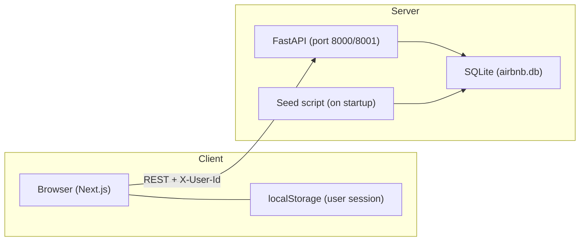
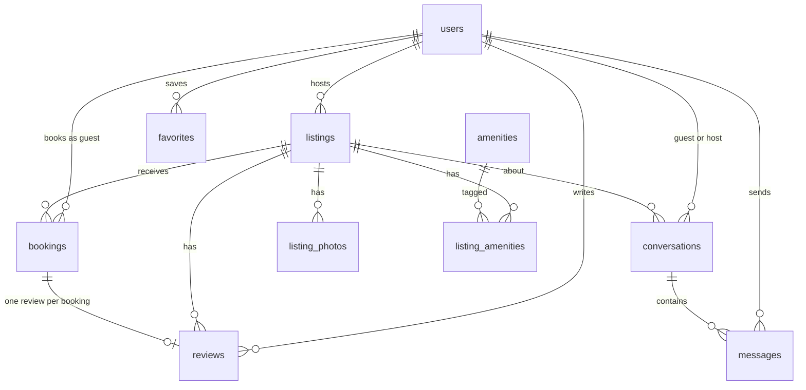

# Airbnb Clone

A full-stack Airbnb-style vacation rental platform. Guests can search and book stays, save wishlists, message hosts, and leave reviews. Hosts can create and manage listings and view incoming bookings. The UI is photo-forward and responsive, with dark mode support.

**Live repo:** https://github.com/orwin1002/airbnb-clone

---

## Tech Stack

| Layer | Technology | Purpose |
|-------|------------|---------|
| **Frontend** | Next.js 16 (App Router) | Server/client React framework |
| | TypeScript | Type-safe frontend code |
| | Tailwind CSS v4 | Utility-first styling |
| | `next-themes` | Dark / light mode |
| | `react-day-picker` | Date range selection |
| | `lucide-react` | Icons |
| **Backend** | FastAPI | REST API |
| | SQLAlchemy 2 | ORM |
| | Pydantic v2 | Request/response validation |
| | Uvicorn | ASGI server |
| **Database** | SQLite | File-based relational DB (`backend/airbnb.db`) |
| **Auth** | Mock session | `X-User-Id` header + `localStorage` (demo login / email+password) |
| **Payments** | Mocked | No real payment gateway |

---

## Architecture Overview

The app follows a **decoupled client–server** architecture: the Next.js frontend talks to the FastAPI backend over HTTP. All persistent data lives in SQLite; the frontend only stores the logged-in user in `localStorage`.



### Request flow

1. User opens the Next.js app → pages fetch public data (`GET /listings`) without auth.
2. On login / demo-login, the API returns a `User` object → stored in `localStorage`.
3. Authenticated requests include the `X-User-Id` header (see `frontend/lib/api.ts`).
4. FastAPI resolves the current user via `get_current_user` (`backend/app/dependencies.py`).
5. Business rules (booking overlap, review eligibility, host-only actions) are enforced in router layer.

### Project structure

```
airbnb-clone/
├── frontend/                 # Next.js application
│   ├── app/                  # App Router pages (/, /listing, /trips, /host, /inbox, …)
│   ├── components/           # UI components (SearchBar, ListingCard, Navbar, …)
│   ├── lib/                  # API client, auth context, types
│   └── public/               # Static assets
├── backend/
│   ├── app/
│   │   ├── main.py           # FastAPI app, CORS, startup seed
│   │   ├── models.py         # SQLAlchemy models
│   │   ├── schemas.py        # Pydantic schemas
│   │   ├── seed.py           # Demo data (users, listings, bookings, …)
│   │   └── routers/          # auth, listings, bookings, hosts, reviews, favorites, messages
│   ├── requirements.txt
│   ├── Procfile              # Render deployment
│   └── airbnb.db             # SQLite file (created at runtime, gitignored)
├── render.yaml               # Render Blueprint config
└── README.md
```

---

## Setup Instructions

### Prerequisites

- **Node.js** 18+
- **Python** 3.11+
- **npm** (comes with Node.js)
- **pip** (comes with Python)

### 1. Clone the repository

```bash
git clone https://github.com/orwin1002/airbnb-clone.git
cd airbnb-clone
```

### 2. Backend

```bash
cd backend
pip install -r requirements.txt
python -m uvicorn app.main:app --reload --host 127.0.0.1 --port 8000
```

On first startup the API will:

- Create `airbnb.db` if it does not exist
- Run migrations (`migrate_schema`)
- Seed demo data (10 users, 100 listings, bookings, reviews, wishlists, messages)

**Useful URLs:**

| URL | Description |
|-----|-------------|
| http://localhost:8000/docs | Interactive API documentation (Swagger) |
| http://localhost:8000/health | Health check (`{"status":"ok"}`) |

### 3. Frontend

In a new terminal:

```bash
cd frontend
npm install
```

Create `frontend/.env.local`:

```env
NEXT_PUBLIC_API_URL=http://localhost:8000
```

Start the dev server:

```bash
npm run dev
```

Open **http://localhost:3000**

### 4. Demo login

Click the **menu icon** (top right) → choose a demo account under **Guest accounts** or **Host accounts**. No password is required for demo users.

| Email | Role |
|-------|------|
| `alex@example.com` | Guest |
| `emma@example.com` | Guest |
| `liam@example.com` | Guest |
| `noah@example.com` | Guest |
| `olivia@example.com` | Guest |
| `priya@example.com` | Host (20 listings) |
| `sarah@example.com` | Host (20 listings) |
| `marcus@example.com` | Host (20 listings) |
| `james@example.com` | Host (20 listings) |
| `david@example.com` | Host (20 listings) |

You can also **Sign up** / **Log in** with email and password via the profile menu.

### 5. Viewing the database

The SQLite file is at `backend/airbnb.db`. Open it with [DB Browser for SQLite](https://sqlitebrowser.org/) or any SQLite viewer.

---

## Database Schema

### Entity-relationship diagram



### Tables

| Table | Key columns | Notes |
|-------|-------------|-------|
| **users** | `id`, `name`, `email`, `password_hash`, `role`, `is_host` | Unique email; demo users have no password |
| **listings** | `host_id`, `title`, `description`, `location_city`, `location_area`, `lat`, `lng`, `price_per_night`, `property_type`, `vibe`, `max_guests`, `bedrooms`, `beds`, `bathrooms` | 100 seeded listings (20 per host) |
| **listing_photos** | `listing_id`, `url`, `sort_order` | External image URLs (Unsplash) |
| **amenities** | `id`, `name` | e.g. WiFi, Pool, Kitchen |
| **listing_amenities** | `listing_id`, `amenity_id` | Many-to-many join |
| **bookings** | `listing_id`, `guest_id`, `check_in`, `check_out`, `guests_count`, `total_price`, `refund_amount`, `status` | `status`: `confirmed` \| `cancelled` |
| **reviews** | `listing_id`, `guest_id`, `booking_id`, `rating`, `comment` | One review per booking; rating 1–5 |
| **favorites** | `user_id`, `listing_id` | Composite primary key (wishlist) |
| **conversations** | `guest_id`, `host_id`, `listing_id` | Unique per (guest, host, listing) |
| **messages** | `conversation_id`, `sender_id`, `body`, `read_at` | Guest–host messaging |

### Key constraints

- **No overlapping confirmed bookings** for the same listing (enforced in `POST /bookings`).
- **One review per booking**; only after `check_out` has passed.
- **Guest favourite badge** (computed, not stored): avg rating ≥ 4.7 and ≥ 3 reviews.

---

## API Overview

Base URL: `http://localhost:8000` (or your deployed backend URL).

**Authentication:** After login, send `X-User-Id: <user_id>` on protected routes. The frontend handles this automatically.

Interactive docs: **GET /docs**

### Auth — `/auth`

| Method | Endpoint | Auth | Description |
|--------|----------|------|-------------|
| POST | `/auth/register` | No | Create account (optional `is_host`) |
| POST | `/auth/login` | No | Login with email + password |
| POST | `/auth/demo-login` | No | One-click demo login (seeded emails only) |
| GET | `/auth/me` | Yes | Current user profile |

### Listings — `/listings`

| Method | Endpoint | Auth | Description |
|--------|----------|------|-------------|
| GET | `/listings` | No | Search/filter listings (`city` or `q`, dates, guests, price, vibe, amenities, pagination) |
| GET | `/listings/{id}` | No | Listing detail |
| POST | `/listings` | Host | Create listing |
| PUT | `/listings/{id}` | Host | Update listing |
| DELETE | `/listings/{id}` | Host | Delete listing |
| GET | `/listings/{id}/availability` | No | Booked date ranges |
| GET | `/listings/{id}/reviews` | No | Reviews for a listing |

**Search:** The `city` query parameter searches across title, city, area, description, vibe, and property type.

### Bookings — `/bookings`

| Method | Endpoint | Auth | Description |
|--------|----------|------|-------------|
| POST | `/bookings` | Yes | Create booking |
| GET | `/bookings/me` | Yes | Guest's trips |
| GET | `/bookings/{id}/refund-preview` | Yes | Refund estimate before cancel |
| PATCH | `/bookings/{id}/cancel` | Yes | Cancel booking |

### Hosts — `/hosts`

| Method | Endpoint | Auth | Description |
|--------|----------|------|-------------|
| GET | `/hosts/me/listings` | Host | Host's listings |
| GET | `/hosts/me/bookings` | Host | Bookings on host's listings |

### Reviews — `/reviews`

| Method | Endpoint | Auth | Description |
|--------|----------|------|-------------|
| POST | `/reviews` | Yes | Leave a review (requires completed stay) |

### Favorites — `/favorites`

| Method | Endpoint | Auth | Description |
|--------|----------|------|-------------|
| POST | `/favorites/{listing_id}` | Yes | Add to wishlist |
| DELETE | `/favorites/{listing_id}` | Yes | Remove from wishlist |
| GET | `/favorites/me` | Yes | User's wishlist |

### Messages — `/messages`

| Method | Endpoint | Auth | Description |
|--------|----------|------|-------------|
| GET | `/messages/conversations` | Yes | List conversations |
| POST | `/messages/conversations` | Yes | Start conversation (guest → host) |
| GET | `/messages/conversations/{id}/messages` | Yes | Get messages |
| POST | `/messages/conversations/{id}/messages` | Yes | Send message |

### Health

| Method | Endpoint | Description |
|--------|----------|-------------|
| GET | `/health` | `{"status":"ok"}` |
| GET | `/` | Redirects to `/docs` |

---

## Features

- **Search** — Filter by keyword (title, city, area), dates, guests (adults/children/infants), price, property type, vibe, amenities
- **Listing detail** — Photo gallery, amenities, host info, availability calendar, price breakdown, reviews, map
- **Booking** — Overlap prevention, mocked checkout, trip management, cancellation with refund preview
- **Host dashboard** — CRUD listings, view bookings on your properties
- **Wishlists** — Save/remove favorites
- **Messaging** — Guest–host inbox with read receipts
- **Reviews** — Post-stay ratings linked to bookings
- **Dark mode** — System / manual toggle via `next-themes`
- **Responsive** — Mobile-friendly layout

---

## Deployment

### Frontend (Vercel)

1. Import https://github.com/orwin1002/airbnb-clone on [vercel.com](https://vercel.com)
2. Set **Root Directory** to `frontend`
3. Environment variable: `NEXT_PUBLIC_API_URL=https://your-backend.onrender.com`
4. Deploy

### Backend (Render)

1. Create a **Web Service** on [render.com](https://render.com) connected to the repo
2. **Root Directory:** `backend`
3. **Build command:** `pip install -r requirements.txt`
4. **Start command:** `uvicorn app.main:app --host 0.0.0.0 --port $PORT`
5. Environment variable: `CORS_ORIGINS=https://your-app.vercel.app`

Alternatively, use the included `render.yaml` Blueprint for one-click backend setup.

> **Note:** SQLite on free-tier cloud hosts may reset on redeploy. The seed script runs on every startup to repopulate demo data.

---

## Assumptions

1. **No real authentication** — Sessions are simulated via `X-User-Id`; suitable for demo/assignment use only.
2. **No real payments** — Checkout is mocked; no Stripe or payment gateway integration.
3. **Photos are URL-based** — Listing images are external Unsplash URLs; there is no file upload.
4. **Map is static** — Listing location uses a static map image, not an interactive map.
5. **Guest vs host roles** — Users have an `is_host` flag; demo accounts are either guest-only or host-only.
6. **Pricing formula** — `total = nights × price_per_night + ₹500 cleaning fee + 12% service fee` (hardcoded).
7. **SQLite for persistence** — Single-file database; not intended for high-concurrency production without migration to Postgres.
8. **Infants excluded from capacity** — Search guest count uses adults + children only (infants do not count toward `max_guests`).
9. **Messaging** — Only guests can initiate conversations; hosts reply in existing threads.
10. **Seed data** — 5 guest accounts and 5 host accounts (20 listings each) are pre-loaded for demonstration.

---

## License

Built as an original assignment submission.
