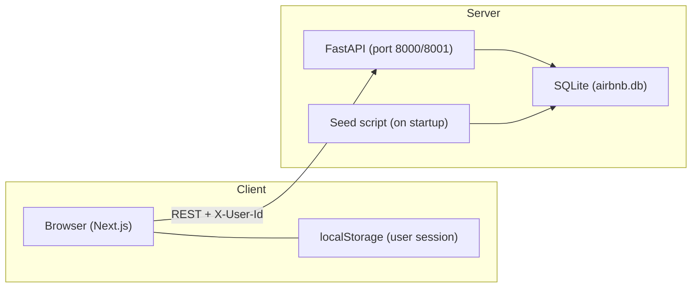
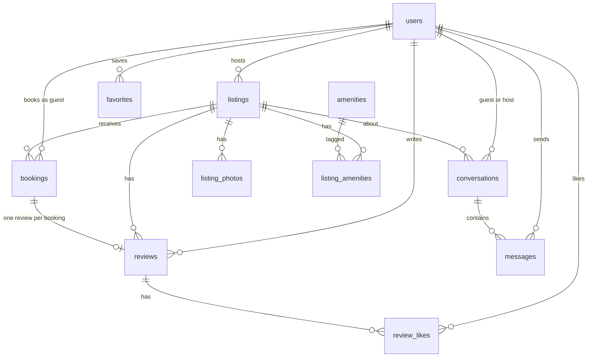

# Airbnb Clone

A full-stack Airbnb-style vacation rental platform. Guests can search and book stays, save wishlists, message hosts, leave reviews, and like reviews. Hosts can create and manage listings, view bookings, reply to reviews, and get notified of new activity. The UI is photo-forward, mobile-first, and supports dark mode, interactive maps, in-app notifications, and mock identity verification.

**Repo:** https://github.com/orwin1002/airbnb-clone

---

## Tech Stack

| Layer | Technology | Purpose |
|-------|------------|---------|
| **Frontend** | Next.js 16 (App Router) | Server/client React framework |
| | TypeScript | Type-safe frontend code |
| | Tailwind CSS v4 | Utility-first styling |
| | `next-themes` | Dark / light mode |
| | `react-day-picker` | Date range selection |
| | `lucide-react` | Icons |
| | `sonner` | Toast notifications |
| | `react-leaflet` / Leaflet | Interactive listing map |
| **Backend** | FastAPI | REST API |
| | SQLAlchemy 2 | ORM |
| | Pydantic v2 | Request/response validation |
| | Uvicorn | ASGI server |
| **Database** | SQLite | File-based relational DB (`backend/airbnb.db`) |
| **Auth** | Mock session | `X-User-Id` header + `localStorage` (demo login / email+password) |
| **Payments** | Mocked | No real payment gateway |

---

## Architecture Overview

The app follows a **decoupled client–server** architecture: the Next.js frontend talks to the FastAPI backend over HTTP. All persistent data lives in SQLite; the frontend only stores the logged-in user in `localStorage`.



### Request flow

1. User opens the Next.js app → pages fetch public data (`GET /listings`) without auth.
2. On login / demo-login, the API returns a `User` object → stored in `localStorage`.
3. Authenticated requests include the `X-User-Id` header (see `frontend/lib/api.ts`).
4. FastAPI resolves the current user via `get_current_user` (`backend/app/dependencies.py`).
5. Business rules (booking overlap, review eligibility, host-only actions) are enforced in router layer.

### Project structure

```
airbnb-clone/
├── frontend/                 # Next.js application
│   ├── app/                  # App Router pages (/, /listing, /trips, /host, /inbox, …)
│   ├── components/           # UI (Navbar, MobileBottomNav, SearchResultsMap, …)
│   ├── lib/                  # API client, auth, notifications, dates, types
│   └── public/               # Static assets
├── backend/
│   ├── app/
│   │   ├── main.py           # FastAPI app, CORS, startup seed
│   │   ├── models.py         # SQLAlchemy models
│   │   ├── schemas.py        # Pydantic schemas
│   │   ├── seed.py           # Demo data (users, listings, bookings, …)
│   │   └── routers/          # auth, listings, bookings, hosts, reviews, favorites, messages
│   ├── requirements.txt
│   └── airbnb.db             # SQLite file (created at runtime, gitignored)
└── README.md
```

---

## Setup Instructions

### Prerequisites

- **Node.js** 18+
- **Python** 3.11+
- **npm** (comes with Node.js)
- **pip** (comes with Python)

### 1. Clone the repository

```bash
git clone https://github.com/orwin1002/airbnb-clone.git
cd airbnb-clone
```

### 2. Backend

```bash
cd backend
pip install -r requirements.txt
python -m uvicorn app.main:app --reload --host 127.0.0.1 --port 8000
```

On first startup the API will:

- Create `airbnb.db` if it does not exist
- Run migrations (`migrate_schema`)
- Seed demo data (10 users, 100 listings, bookings, reviews, wishlists, messages)

**Useful URLs:**

| URL | Description |
|-----|-------------|
| http://localhost:8000/docs | Interactive API documentation (Swagger) |
| http://localhost:8000/health | Health check (`{"status":"ok"}`) |

### 3. Frontend

In a new terminal:

```bash
cd frontend
npm install
```

Create `frontend/.env.local`:

```env
NEXT_PUBLIC_API_URL=http://localhost:8000
```

Start the dev server:

```bash
npm run dev
```

Open **http://localhost:3000**

### 4. Demo login

Click the **menu icon** (top right) → choose a demo account under **Guest accounts** or **Host accounts**. No password is required for demo users.

On **mobile**, use the bottom **Profile** tab or the hamburger menu for the same demo switcher. Host accounts also get a **Hosting** tab in the bottom nav.

| Email | Role |
|-------|------|
| `alex@example.com` | Guest |
| `emma@example.com` | Guest |
| `liam@example.com` | Guest |
| `noah@example.com` | Guest |
| `olivia@example.com` | Guest |
| `priya@example.com` | Host (20 listings) |
| `sarah@example.com` | Host (20 listings) |
| `marcus@example.com` | Host (20 listings) |
| `james@example.com` | Host (20 listings) |
| `david@example.com` | Host (20 listings) |

You can also **Sign up** / **Log in** with email and password via the profile menu.

### 5. Viewing the database

All server-side data is stored in `backend/airbnb.db` (created on first backend startup). Sign-up accounts, bookings, messages, and other app data are saved there. Open the file with [DB Browser for SQLite](https://sqlitebrowser.org/) or any SQLite viewer.

---

## Database Schema

### Entity-relationship diagram



### Tables

| Table | Key columns | Notes |
|-------|-------------|-------|
| **users** | `id`, `name`, `email`, `password_hash`, `role`, `is_host`, `identity_verified` | Unique email; demo users have no password |
| **listings** | `host_id`, `title`, `description`, `location_city`, `location_area`, `lat`, `lng`, `price_per_night`, `property_type`, `vibe`, `max_guests`, `bedrooms`, `beds`, `bathrooms` | 100 seeded listings (20 per host) |
| **listing_photos** | `listing_id`, `url`, `sort_order` | External image URLs (Unsplash) |
| **amenities** | `id`, `name` | e.g. WiFi, Pool, Kitchen |
| **listing_amenities** | `listing_id`, `amenity_id` | Many-to-many join |
| **bookings** | `listing_id`, `guest_id`, `check_in`, `check_out`, `guests_count`, `total_price`, `refund_amount`, `status` | `status`: `confirmed` \| `cancelled` |
| **reviews** | `listing_id`, `guest_id`, `booking_id`, `rating`, `comment`, `host_reply`, `host_reply_at` | One review per booking; rating 1–5; optional host reply |
| **review_likes** | `review_id`, `user_id` | Composite primary key; any logged-in user can like a review |
| **favorites** | `user_id`, `listing_id` | Composite primary key (wishlist) |
| **conversations** | `guest_id`, `host_id`, `listing_id` | Unique per (guest, host, listing) |
| **messages** | `conversation_id`, `sender_id`, `body`, `read_at` | Guest–host messaging |

### Key constraints

- **No overlapping confirmed bookings** for the same listing (enforced in `POST /bookings`).
- **One review per booking**; only after `check_out` has passed.
- **Guest favourite badge** (computed, not stored): avg rating ≥ 4.7 and ≥ 3 reviews.

---

## API Overview

Base URL: `http://localhost:8000`

**Authentication:** After login, send `X-User-Id: <user_id>` on protected routes. The frontend handles this automatically.

Interactive docs: **GET /docs**

### Auth — `/auth`

| Method | Endpoint | Auth | Description |
|--------|----------|------|-------------|
| POST | `/auth/register` | No | Create account (optional `is_host`) |
| POST | `/auth/login` | No | Login with email + password |
| POST | `/auth/demo-login` | No | One-click demo login (seeded emails only) |
| GET | `/auth/me` | Yes | Current user profile |
| POST | `/auth/verify-identity` | Yes | Mock identity verification (sets `identity_verified`) |

### Listings — `/listings`

| Method | Endpoint | Auth | Description |
|--------|----------|------|-------------|
| GET | `/listings` | No | Search/filter listings (`city` or `q`, dates, guests, price, vibe, amenities, pagination) |
| GET | `/listings/{id}` | No | Listing detail |
| POST | `/listings` | Host | Create listing |
| PUT | `/listings/{id}` | Host | Update listing |
| DELETE | `/listings/{id}` | Host | Delete listing |
| GET | `/listings/{id}/availability` | No | Booked date ranges |
| GET | `/listings/{id}/reviews` | No* | Reviews for a listing (includes like counts, host replies; `liked_by_me` when logged in) |

\* Optional auth via `X-User-Id` for personalized fields.

**Search:** The `city` query parameter searches across title, city, area, description, vibe, and property type.

### Bookings — `/bookings`

| Method | Endpoint | Auth | Description |
|--------|----------|------|-------------|
| POST | `/bookings` | Yes | Create booking |
| GET | `/bookings/me` | Yes | Guest's trips |
| GET | `/bookings/{id}/refund-preview` | Yes | Refund estimate before cancel |
| PATCH | `/bookings/{id}/cancel` | Yes | Cancel booking |

### Hosts — `/hosts`

| Method | Endpoint | Auth | Description |
|--------|----------|------|-------------|
| GET | `/hosts/me/listings` | Host | Host's listings |
| GET | `/hosts/me/bookings` | Host | Bookings on host's listings |
| GET | `/hosts/me/reviews` | Host | Reviews on host's listings (with likes and replies) |

### Reviews — `/reviews`

| Method | Endpoint | Auth | Description |
|--------|----------|------|-------------|
| POST | `/reviews` | Yes | Leave a review (requires completed stay) |
| POST | `/reviews/{id}/like` | Yes | Toggle like on a review |
| POST | `/reviews/{id}/reply` | Host | Reply to a review on your listing |
| GET | `/reviews/me/tracked` | Yes | Reviews you wrote or received as host (for notification sync) |

### Favorites — `/favorites`

| Method | Endpoint | Auth | Description |
|--------|----------|------|-------------|
| POST | `/favorites/{listing_id}` | Yes | Add to wishlist |
| DELETE | `/favorites/{listing_id}` | Yes | Remove from wishlist |
| GET | `/favorites/me` | Yes | User's wishlist |

### Messages — `/messages`

| Method | Endpoint | Auth | Description |
|--------|----------|------|-------------|
| GET | `/messages/conversations` | Yes | List conversations |
| POST | `/messages/conversations` | Yes | Start conversation (guest → host) |
| POST | `/messages/conversations/for-guest` | Host | Start conversation with a guest (from host dashboard) |
| GET | `/messages/conversations/{id}/messages` | Yes | Get messages |
| POST | `/messages/conversations/{id}/messages` | Yes | Send message |

### Health

| Method | Endpoint | Description |
|--------|----------|-------------|
| GET | `/health` | `{"status":"ok"}` |
| GET | `/` | Redirects to `/docs` |

---

## Features

### Search & discovery
- Filter by keyword (title, city, area, description, vibe, property type), dates, guests (adults/children/infants), price, property type, vibe, amenities
- **Interactive map** on the homepage — price pins with photo popups; split list/map on desktop, full-screen map modal on mobile
- Listings include `lat` / `lng` for map placement (Bangalore & Mumbai seed data)

### Listings & booking
- Photo gallery, amenities, host info, availability calendar, price breakdown, reviews
- **Identity verification gate** — mock ID upload flow; booking and messaging require verification
- **Date overlap prevention** — blocked nights prevent double-booking; Reserve disabled with clear error when dates conflict
- Mock checkout, trip management, cancellation with refund preview
- **Mobile sticky Reserve bar** on listing pages with guest picker (adults / children / infants)

### Host tools
- Host dashboard with **Listings**, **Bookings**, and **Reviews** tabs
- CRUD listings (with delete confirmation), view bookings, **message guests** from bookings
- **Reply to reviews** and like reviews from the Reviews tab
- **Hosting tab** in mobile bottom nav for host accounts

### Reviews
- Post-stay reviews linked to bookings (after checkout, from **Trips**)
- **Like reviews** — any logged-in user; counts visible on listing pages
- **Host replies** — shown on listing pages; live-updated via polling
- Review notifications deep-link to the listing review (`/listing/{id}#review-{id}`)

### Social & communication
- Wishlists — save/remove favorites
- Guest–host **inbox** with read receipts and live polling
- **Message notifications** — bell alerts when someone sends you a message (polls inbox every 4s)
- **Review notifications** — bell alerts for new reviews (hosts), likes, and host replies (guests)

### Notifications (client-side)
- Navbar **notification bell** with unread count
- Per-user storage in `localStorage` (`app_notifications_by_user`)
- Types: booking, message, review, wishlist, verification, sign-in
- Toast popups via `sonner` for new messages and events; review toasts include a **View** link

### Mobile UX
- **Bottom tab bar** — Explore, Wishlists, Trips, Inbox, Profile (+ **Hosting** for host accounts)
- Top bar — logo, dark mode, notifications, hamburger menu (demo account switcher)
- Bottom nav hidden on listing detail pages (sticky booking bar instead)
- Profile sheet — verify identity, host dashboard link, log out

### Other
- Dark mode — system / manual toggle via `next-themes`
- Guest favourite badge — avg rating ≥ 4.7 with ≥ 3 reviews

---

## Assumptions

1. **No real authentication** — Sessions are simulated via `X-User-Id`; suitable for demo/assignment use only.
2. **No real payments** — Checkout is mocked; no Stripe or payment gateway integration.
3. **No real identity verification** — ID upload is a mock UI; any file completes verification instantly.
4. **Notifications are client-side** — Stored in `localStorage` per user; not pushed from a server. Message and review alerts use polling (`/messages/conversations`, `/reviews/me/tracked`).
5. **Photos are URL-based** — Listing images are external Unsplash URLs; there is no file upload.
6. **Map uses OpenStreetMap tiles** — Listing location is shown with Leaflet; no custom map API key is required.
7. **Guest vs host roles** — Users have an `is_host` flag; demo accounts are either guest-only or host-only.
8. **Pricing formula** — `total = nights × price_per_night + ₹500 cleaning fee + 12% service fee` (hardcoded).
9. **SQLite for persistence** — Single-file database; not intended for high-concurrency production without migration to Postgres.
10. **Infants excluded from capacity** — Search guest count uses adults + children only (infants do not count toward `max_guests`).
11. **Messaging** — Guests can start conversations from listing pages; hosts can also start conversations with guests from the host dashboard bookings tab.
12. **Reviews** — One review per completed booking; hosts can post one public reply per review; likes are toggled per user.
13. **Seed data** — 5 guest accounts and 5 host accounts (20 listings each, Bangalore & Mumbai) are pre-loaded for demonstration.

---

## License

Built as an original assignment submission.
