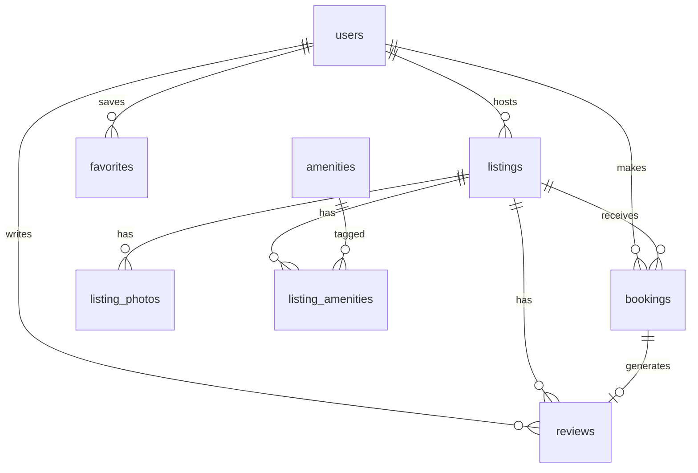

# Airbnb Clone

A full-stack Airbnb clone built for the SDE Fullstack assignment. Browse and search listings, book stays, manage host listings, save favorites, and toggle dark mode — all with a photo-forward UI inspired by Airbnb.

## Tech Stack

| Layer | Technology |
|-------|------------|
| Frontend | Next.js 16 (TypeScript, App Router, Tailwind CSS v4) |
| Backend | FastAPI + SQLAlchemy |
| Database | SQLite |
| Auth | Mocked (email-based demo login) |
| Payments | Mocked checkout |

## Project Structure

```
airbnb-clone/
├── frontend/          # Next.js app
├── backend/           # FastAPI API + SQLite
└── README.md
```

## Quick Start

### Prerequisites

- Node.js 18+
- Python 3.11+

### Backend

```bash
cd backend
pip install -r requirements.txt
uvicorn app.main:app --reload --port 8000
```

The API seeds sample data on first startup. Docs: http://localhost:8000/docs

### Frontend

```bash
cd frontend
npm install
npm run dev
```

Open http://localhost:3000

Set `NEXT_PUBLIC_API_URL=http://localhost:8000` in `frontend/.env.local` (already configured).

## Demo Login

Use the profile menu (top right) to log in with seeded accounts:

| Email | Role |
|-------|------|
| `alex@example.com` | Guest + Host |
| `emma@example.com` | Guest |
| `sarah@example.com` | Host |
| `marcus@example.com` | Host |

## Features

- **Home / Search** — Grid of listings, search bar (location, dates, guests), filters, pagination
- **Listing Detail** — Gallery, amenities, host info, availability calendar, price breakdown, reviews, static map
- **Booking Flow** — Date validation (client + server), overlap prevention, mocked confirmation, My Trips
- **Host CRUD** — Create/edit/delete listings, host dashboard with bookings
- **Wishlist** — Save/remove favorites
- **Dark Mode** — `next-themes` with semantic color tokens
- **Responsive** — Mobile-friendly layout

## Database Schema



**Key constraint:** No overlapping confirmed bookings for the same listing (enforced in `POST /bookings`).

## API Overview

| Method | Endpoint | Description |
|--------|----------|-------------|
| POST | `/auth/login` | Mock login by email |
| GET | `/auth/me` | Current user (requires `X-User-Id` header) |
| GET | `/listings` | Search/filter listings |
| GET | `/listings/{id}` | Listing detail |
| POST | `/listings` | Create listing (host) |
| PUT | `/listings/{id}` | Update listing (host) |
| DELETE | `/listings/{id}` | Delete listing (host) |
| GET | `/listings/{id}/availability` | Booked date ranges |
| GET | `/listings/{id}/reviews` | Reviews |
| POST | `/bookings` | Create booking |
| GET | `/bookings/me` | Guest trips |
| GET | `/hosts/me/listings` | Host listings |
| GET | `/hosts/me/bookings` | Host bookings |
| POST/DELETE | `/favorites/{id}` | Add/remove favorite |
| GET | `/favorites/me` | User wishlist |
| POST | `/reviews` | Leave a review |

Auth: after login, the frontend stores the user in `localStorage` and sends `X-User-Id` on authenticated requests.

## Deployment

### Frontend (Vercel)

1. Push to GitHub
2. Import repo in Vercel, set root directory to `frontend/`
3. Add env var: `NEXT_PUBLIC_API_URL=https://your-backend.onrender.com`

### Backend (Render / Railway)

1. Deploy `backend/` as a web service
2. Start command: `uvicorn app.main:app --host 0.0.0.0 --port $PORT`
3. Set `CORS_ORIGINS` to your Vercel URL

> **Note:** SQLite on free-tier cloud hosts may reset on redeploy. The seed script runs on startup so the demo stays populated.

## Assumptions

- No real authentication or payment processing
- Photos are URL-based (Unsplash); no file upload
- Map is a static OpenStreetMap image, not interactive
- One user can be both guest and host (`is_host` flag)
- Cleaning fee ($50) and service fee (12%) are hardcoded in booking price calculation

## License

Built as an original assignment submission.
